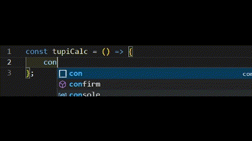

# TupiCalc

TupiCalc is a Visual Studio Code extension that provides real-time calculation of mathematical expressions within your code comments.

## Features

-   Automatically calculates mathematical expressions in code comments
-   Displays results inline without modifying your code
-   Supports basic arithmetic operations and common mathematical functions
-   Can be easily toggled on/off



## Requirements

This extension requires Visual Studio Code version 1.60.0 or higher.

## Extension Settings

This extension contributes the following settings:

-   `tupicalc.isDisabled`: Enable/disable the TupiCalc extension.

## How to Use

1. Install the TupiCalc extension from the VS Code Marketplace.
2. Open a file in VS Code.
3. Type a mathematical expression in a code comment, for example:
    ```javascript
    // 2 + 2 = ?
    ```

````

4. The extension will automatically calculate the result and display it inline:
    ```javascript
    // 2 + 2 = 4
    ```

To toggle the extension on/off:

1. Open the Command Palette (Ctrl+Shift+P or Cmd+Shift+P)
2. Type "Toggle TupiCalc Extension" and select it

## Known Issues

-   Complex mathematical functions may not be supported.

## Release Notes

### 1.0.0

-   Basic arithmetic operations support
-   Inline display of results
-   Toggle functionality

---

## Contributing

If you have suggestions for improvements or encounter any issues, please file an issue on our [GitHub repository](https://github.com/TupiC/tupi-calc).

## License

This extension is licensed under the [License](license.md).

**Enjoy calculating with TupiCalc!**

```

````
